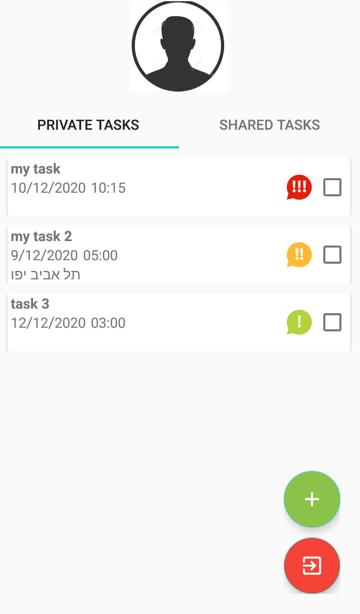

# RemindMe
App for reminders and sharing reminders and tasks with your friends!

The app focuses on what really matters, and that's the theme of mention! 
The goal is to create a simple and convenient interface, which is updated in real-time between all the user's devices and in front of the users with whom the user has chosen to share the reminders/tasks. 
The reminders are Location/date-based. 
In addition, the option of coding tasks via colors, so that the user can control the priorities of his tasks.

## Screenshots

  
  
  
  

